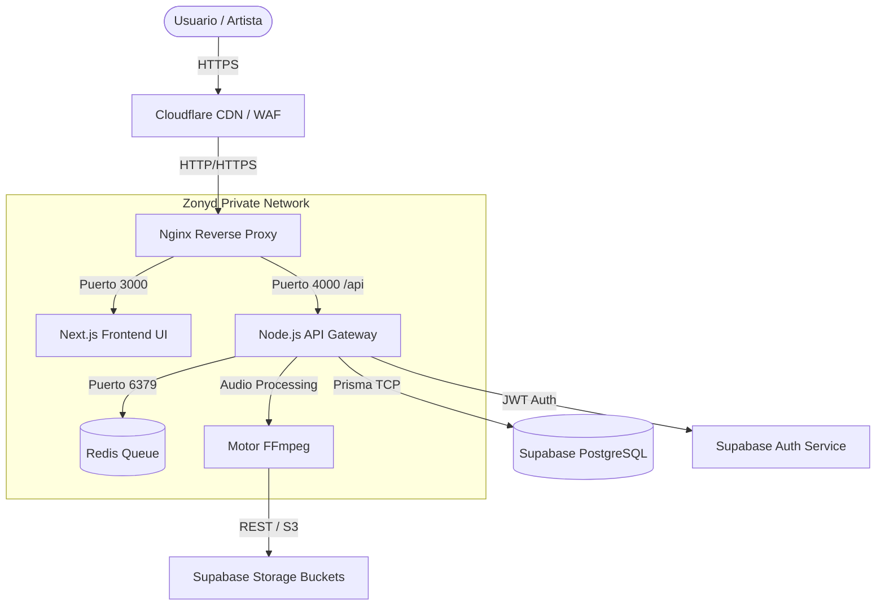

# 🌐 Arquitectura y Ecosistema de Zonyd OS

Este documento detalla exhaustivamente la infraestructura, arquitectura, y ecosistema tecnológico de **Zonyd OS**, la plataforma de distribución musical y gestión de artistas de próxima generación.

---

## 1. Topología del Ecosistema

Zonyd OS opera bajo un modelo de arquitectura de microservicios distribuidos, optimizada para alta disponibilidad, seguridad y procesamiento intensivo de medios (audio de alta fidelidad).

### 1.1 Stack Tecnológico Principal (MERN/Next)
*   **Frontend (Dashboard):** Next.js 14 (App Router), React 19, Tailwind CSS v4, TypeScript.
*   **Backend (API Server):** Node.js 20, Express.js 5.2.
*   **Base de Datos Relacional:** PostgreSQL 16 (gestionado vía Supabase).
*   **Caché y Colas Asíncronas:** Redis (BullMQ).
*   **ORM:** Prisma ORM v6.19.
*   **Gestión de Archivos:** Supabase Storage (S3-compatible) & procesamiento local temporal.

---

## 2. Diagrama de Arquitectura de Red

La plataforma utiliza **Nginx** como un proxy inverso de grado de producción que orquesta el tráfico entre el mundo exterior y los contenedores internos aislados.

---

## 3. Módulos y Servicios del Backend

El backend está construido bajo un patrón arquitectónico de Controladores-Servicios (MVC sin V) para separar responsabilidades lógicas.

### 3.1 Servicios de Dominio
*   **`distributionService.js`**: El núcleo de la plataforma. Envía metadatos de lanzamientos musicales a las tiendas DSP (Digital Service Providers como Spotify o Apple Music). Opera a través de colas asíncronas para no bloquear la experiencia del usuario. Incluye un sistema de *Fallback* local (ejecución síncrona/en segundo plano) si Redis se desconecta, garantizando que el servicio nunca se detenga.
*   **`ffmpegService.js`**: Motor de transcodificación de audio. Normaliza el audio usando estándares LUFS (-14) y genera los másters en formatos `FLAC`, `AAC` (256k) y `MP3` (320k) aptos para distribución comercial.
*   **`codeService.js`**: Motor generador de estándares de la industria musical. Genera códigos **ISRC** (International Standard Recording Code) y **UPC** (Universal Product Code) de 12 dígitos, validando colisiones en la base de datos.
*   **`emailService.js`**: Integración con **Resend** para el envío transaccional de correos (Aprobaciones de lanzamientos, retiros de dinero, invitaciones de equipo).

### 3.2 Middlewares y Seguridad Perimetral
La plataforma cumple con estándares de seguridad bancarios para proteger las regalías:
*   **`authMiddleware.js`**: Validación estricta del JWT nativo de Supabase en cada petición. Garantiza que el usuario es quien dice ser.
*   **`rbacMiddleware.js`**: Control de Acceso Basado en Roles (RBAC). Aísla rutas administrativas de usuarios normales (e.g., solo un administrador puede acceder a `/api/admin/releases/:id/approve`).
*   **`uploadMiddleware.js`**: Filtros de seguridad en la carga de archivos vía Multer. Bloquea de raíz archivos que no sean audios válidos (MIME types permitidos: `audio/mpeg`, `audio/wav`, `audio/x-wav`), previniendo ejecución de código remoto o inyección de malware.
*   **Express Rate Limiting & Helmet**: Prevención nativa contra ataques DDoS y vulnerabilidades comunes de cabeceras web (XSS, Clickjacking).
*   **CORS Estricto**: Restringido para aceptar peticiones únicas desde los dominios oficiales (`zonyd.com`).

---

## 4. Frontend: Zonyd Dashboard

La aplicación cliente de Zonyd OS está diseñada como una SPA (Single Page Application) hiper-optimizada mediante Next.js.

### 4.1 Características de Interfaz (UI/UX)
*   **Diseño Premium y Oscuro (Dark Mode):** Creado mediante variables nativas y Tailwind CSS, proporcionando un entorno "Midnight" atractivo para la cultura musical.
*   **Motor Analítico Reactivo:** Uso extensivo de **Recharts** para visualización de "Streams" y "Regalías" en tiempo real. 
*   **Gestión de Estados e Hidratación:** Prevención de "Hydration Mismatches" mediante hooks personalizados de montado (`isMounted`), asegurando transiciones fluidas.

### 4.2 Módulos Funcionales
*   **Onboarding Dinámico:** Flujo de recolección de datos progresivo que establece el perfil inicial del artista (`stageName`, conectividad de billetera).
*   **Lanzador de Tracks (Release Manager):** Asistente multipaso tipo *Wizard* que permite arrastrar audios, cargar portadas y rellenar metadatos legales, comunicándose directamente con `uploadController`.
*   **The Lab (Motor de Audio IA):** Herramienta nativa para evaluación sónica de audios previa a la distribución.
*   **Billetera y Regalías:** Panel financiero autenticado que calcula ingresos, solicita extracciones (Payouts) verificando saldos reales directamente con la BD para prevenir desbalances.
*   **AI Co-Manager:** Un widget de asistente inteligente global, persistente a lo largo de todas las vistas, conectado al backend (`/api/ai/chat`) para proveer asistencia en estrategias de marketing.

---

## 5. Base de Datos (Esquema Entidad-Relación)

El modelo en Prisma está diseñado para un sistema Multi-Tenant (Artistas, Sellos Discográficos, y Administradores).

*   `User`: Entidad central de autenticación y roles.
*   `Artist` / `Organization`: Entidades de perfil de negocio. Un `User` puede ser dueño de un `Artist` o pertenecer a una `Organization` (Sello).
*   `Release` / `Track`: Relación One-to-Many. Un lanzamiento contiene las portadas y fechas, los tracks contienen el audio y la metadata acústica.
*   `Wallet` / `Royalty` / `Payout`: Entidades financieras de doble entrada que evitan números negativos. Se calculan mediante sumas agregadas en tiempo real (`aggregate({ _sum })`).
*   `DspDelivery`: Registro de auditoría que guarda el estado de cada tienda (Enviado a Spotify, Retirado de Apple, etc.).

---

## 6. Pruebas y Aseguramiento de Calidad (QA)

El código ha sido sometido a una revisión profunda y validado con Vitest y Supertest:
*   **100% Passing Tests:** Validación confirmada de los generadores de ISRC, cálculos de billetera con usuarios sin historial (evitando NullPointers), y Health Checks de infraestructura.
*   **Limpieza Quirúrgica:** Se purgaron endpoints vulnerables (`/clear-all` en admin) y se resolvieron errores estructurales de Prisma (consultas de campos inexistentes de Track hacia Artist).

---

## 7. Despliegue CI/CD

El ecosistema está contenido y listo para ser orquestado:
*   **Docker:** `Dockerfile` separados e independientes para backend (con FFMpeg y dependencias nativas de C++) y frontend (multistage Alpine ligero).
*   **GitHub Actions:** `.github/workflows/main.yml` que valida la infraestructura (Test y Build) en cada cambio (Push).
*   **Deployment Script (`deploy.sh`):** Ejecutable Shell optimizado para servidores de producción (AWS EC2 / Digital Ocean) que reinicia contenedores y verifica el `health check` sin provocar caída del servicio (*Downtime* minimizado).

Zonyd OS representa una arquitectura madura, blindada a nivel de red y código, y estructurada para soportar carga escalable de distribución global de medios.
